---
aliases:
- bemlyGPT
tags:
- Code Readme
time: 2023-06-30 10:28
progress: 已归档
简介: 一个简陋的聊天室实现
---

# 概述

一个简陋的聊天室实现，采用Java编写，随手做的，非本机环境编写，环境懒得配了就没有使用Maven，库我放在项目的jar文件夹里面了  
因为本文档作为blog一起更新，可能有点啰嗦，请多多谅解

# 开发环境

先叠甲，这个是随便做的，其次做的时候是用的校园环境，所以说每个过程都非常繁杂且古早。AI Bot用的微软的Azure OpenAI GPT-3.5模型，在聊天室输入/Bot + 内容，就能和机器人对线了，SYSTEM/USER/ASSISTANT分别对应聊天规则的严格或者宽松，超过规则就会触发OpenAI的政策安全警告，返回400的报错码（别问我怎么知道的）。数据库采用更加古早的版本，JDBC用的mysql-connector-5.1.13桥梁，MySQL用的远古5.1.47社区版，Navicat for MySQL也不知道是从哪个包浆软件提供商搞来的。环境是JavaSE 1.8，新版jar包基本上都能兼容可还行，目前java8的地位还是可以的。IDE也是超级古老的Eclipse Luna和Microsoft Visual Studio 2010。

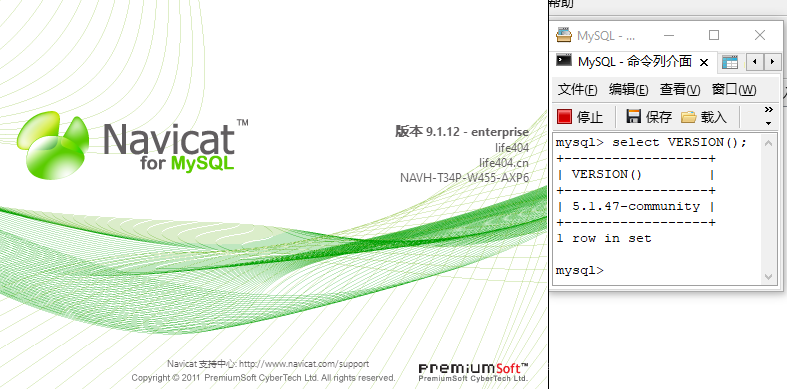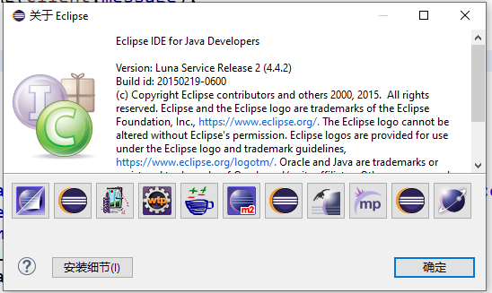

主题用的JTatto，目前写了websocket方式、TCP自创上层协议方式收发数据，载体也分了直接使用字节流读取前字节来区分数据信息和直接采用JSON序列/反序列化发送消息的方式。**代码全部使用GBK编码编写，注意查看的时候要以GBK为编码**

# 项目分支

TCP-json：利用TCP+主流JSON数据结构传输数据  
WebSocket-json：利用Websocket+用主流JSON数据结构传输数据传输数据  
TCP-streamText：利用TCP识别字节流前几位再识别文本内容传输数据  
**TODO**：现在都是MySQL，之后学完MongoDB，做完Swing DIY GUI再来重构

# 项目快照

## 1.主页面

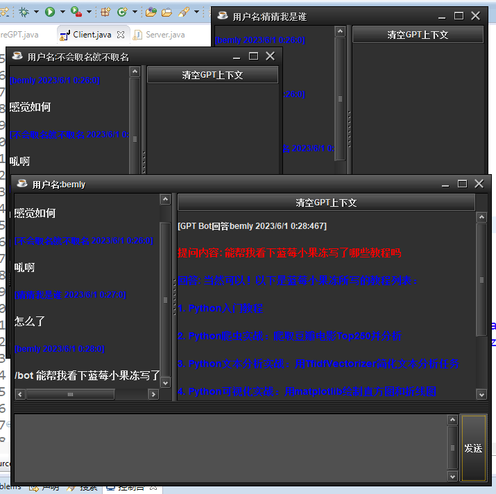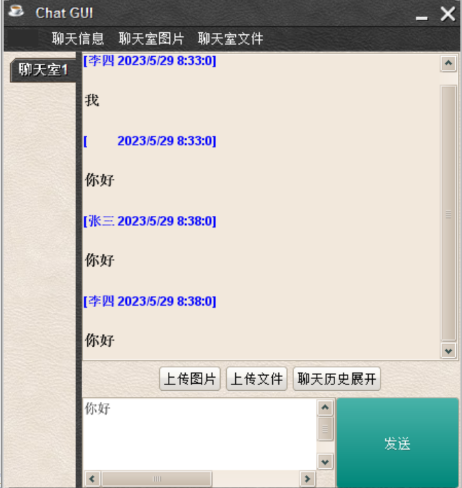

## 2.后台输出

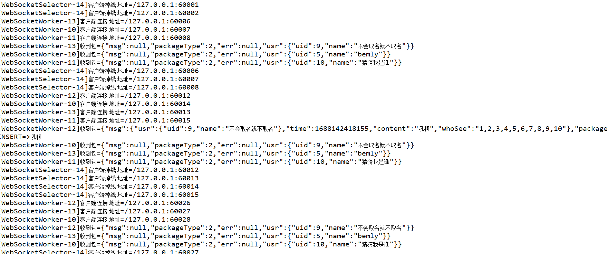

## 3.数据库

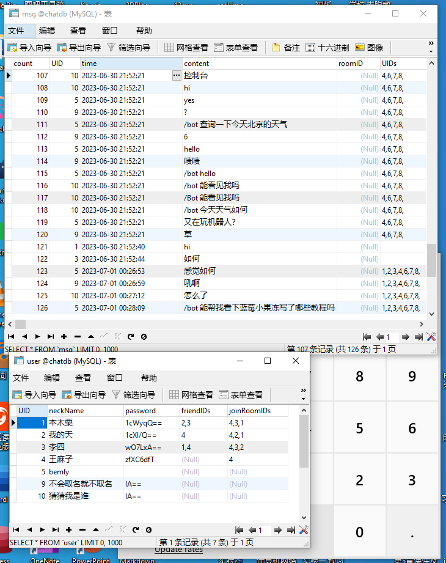

## 4.设计图(乱画就对了)

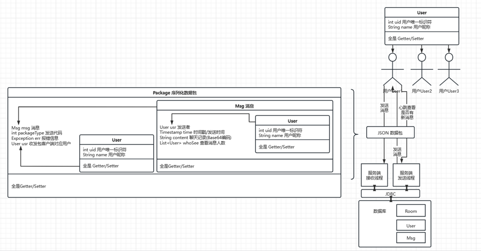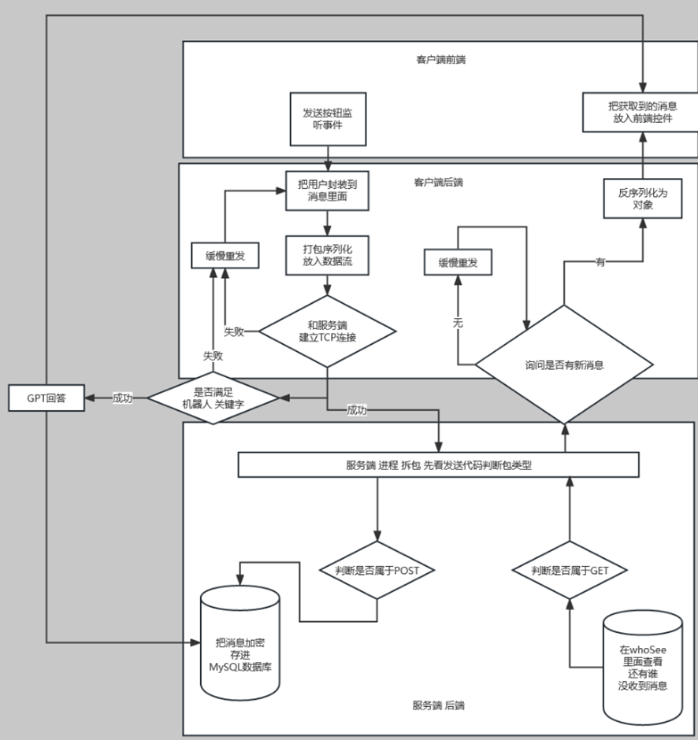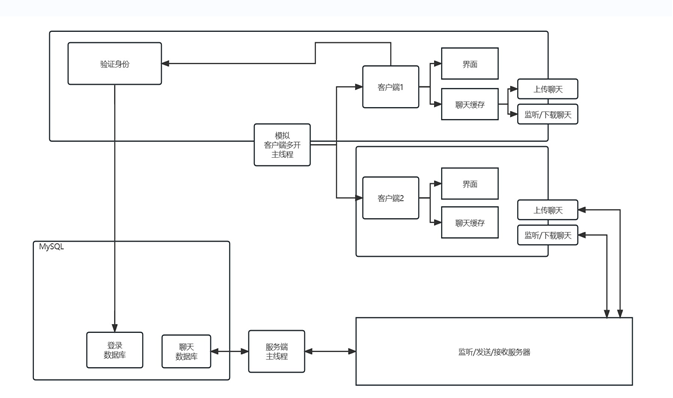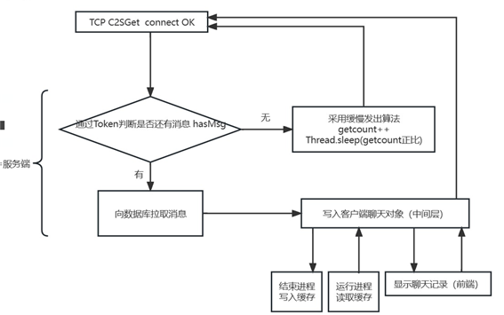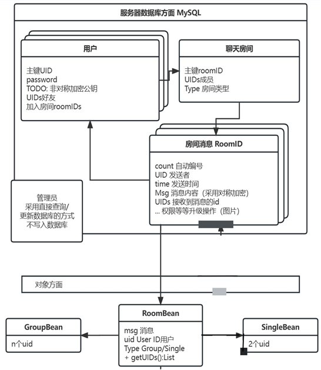

# 如何使用

## 1.获得Azure OpenAI的使用资格

首先去国际版Azure开通OpenAI服务，注意不要选[世纪互联(https://www.azure.cn/)](https://www.azure.cn/)，这货现在还不支持azure openai服务，好消息是国际版的OpenAI是面向全球的包括中国，同时得益于微软Azure的功劳，这个API的使用国内是可以直连的，虽说需要付费但是免费第一个月的200美元配额还是挺香的，详细定价：https://azure.microsoft.com/zh-cn/pricing/details/cognitive-services/openai-service/  
一般来说复制一段1000行的代码给GPT观摩差不多就4000标记（azure限制一次上下文每分钟只能4000标记）

在创建项目之前还需要申请，如果是Github学生包的话可以直接通过创建的（可以自己创建，如果没有邮箱的话也可以去某些交易平台获取，但是不建议），不是的话就只能以企业的口吻申请，具体神仙过海各显神通咯。申请提示就是：**案例场景尽可能跟语言模型相关，不要涉及 DALL-E**、**全程用英文填写**

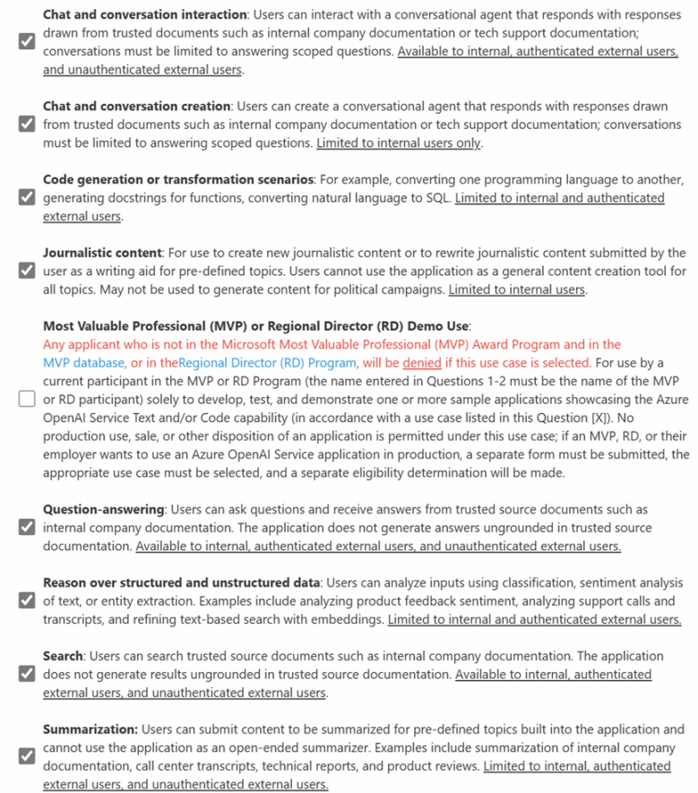

一般没有企业游戏可以用wecom.work的企业微信邮箱去申请，通过的概率更大些，一般同意的时间也很快，差不多一天不到就能出结果，要是被Denied也不用慌，反正可以一直申请着走，换个法子说不定就能通过了，然后跟着其他教程一路创建好模型就行

## 2.填写密钥、终结点和部署名

在主页>认知服务 | Azure OpenAI>概述>开发里面就能找到密钥和终结点

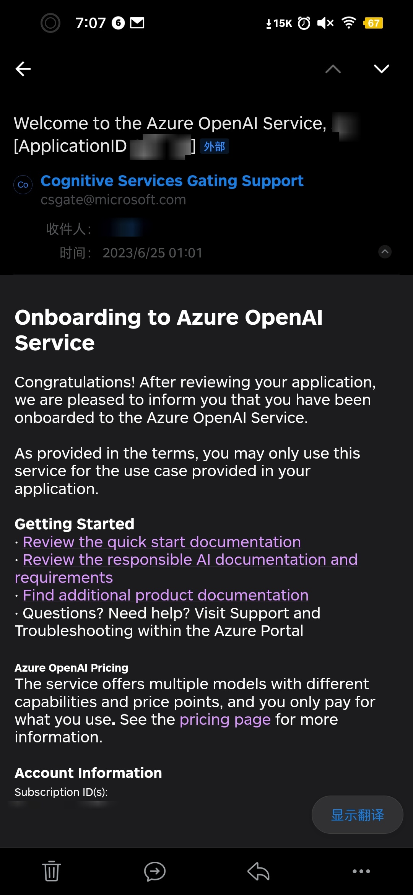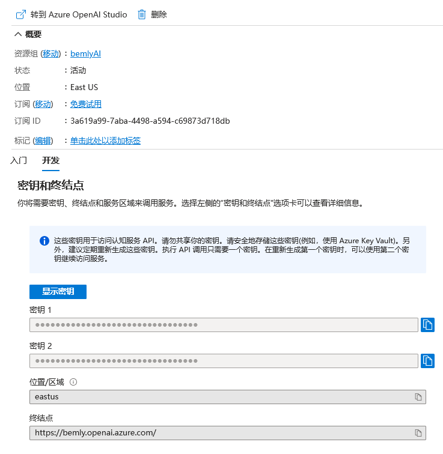

按照官方的示例：https://learn.microsoft.com/zh-cn/azure/cognitive-services/openai/quickstart?pivots=programming-language-java&tabs=command-line#create-a-sample-application  
导入com.azure.ai和com.azure.core以及对应的依赖包就能够运行了，本项目在Client$Bot.java里面找到azureOpenaiKey，endpoint，modelId三个字符串字段填上即可，也懒得打包了，这仨分别填密钥1/2其中一个，终结点和部署名，比如我这里部署名就是bemlyNya

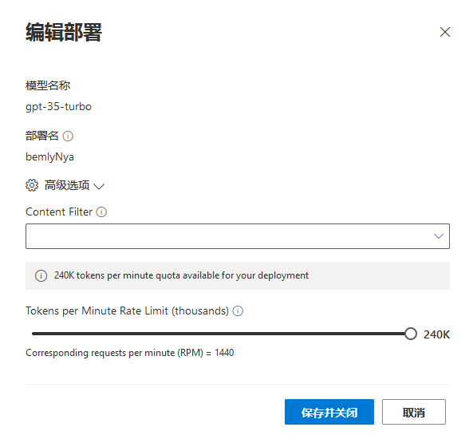

## 3.导入项目，运行

随便选个趁手的IDE导入，这里我用的远古eclipse直接导入项目文件就行，然后填写好上述直接运行Server.java和Client.java

# 勘误

有误的地方可以提Issue，我会尽量处理，目前暂无

# 分享

我试用一个月也用不完，先放出来分享给大家一起用了，主要拿它问正经问题就行，别搞事，怕我的账号被回收了  
密钥2：bdb551ca5b5046f0b0958fe6a884f0b7  
终结点：https://bemly.openai.azure.com/  
gpt-35-turbo模型部署名：bemlyNya  
text-davinci-003模型部署名：bemlyDavNya  
text-embedding-ada-002模型部署名：bemlyEmbedNya

------

# 引用

\[晓晨Master：使用 Azure OpenAI 打造自己的 ChatGPT]: https://www.cnblogs.com/stulzq/p/17271937.html  
\[阿法兔研究笔记：如何搞到一个 Azure OpenAI 的账号]: https://foresightnews.pro/article/detail/26826  
\[快速入门：开始通过 Azure OpenAI 服务使用 ChatGPT 和 GPT-4]: https://learn.microsoft.com/zh-cn/azure/cognitive-services/openai/chatgpt-quickstart  
\[Richasy：Fantasy Copilot]: https://github.com/Richasy/FantasyCopilot

特别鸣谢其他开源项目对本项目的支持和这些文章的分享以及正在阅读这段文字的你  
该文章自豪的采用***Typora***编写
